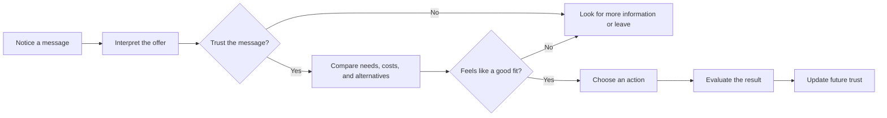

# Chapter 1: Persuasion and Human Decision-Making

Persuasion is the practice of shaping how people notice, interpret, trust, and respond to something. It appears in advertising, political speech, product design, teaching, public health, and everyday conversation. A designer persuades when a page makes one action easier to notice, when an image gives a product a particular mood, or when a name helps an unfamiliar idea feel understandable.

Persuasion does not magically force a decision. It works by influencing the conditions around a decision: what receives attention, which meaning seems plausible, how much trust a message earns, and what action feels reasonable next.

## Persuasion, Coercion, and Manipulation

These ideas overlap, but they are not interchangeable.

| Approach | What happens | Is meaningful choice preserved? | Example |
|---|---|---:|---|
| Persuasion | Reasons, evidence, emotion, or presentation encourage a choice | Usually yes | A T-shirt page explains its fabric and shows how it fits |
| Coercion | Threats, force, or punishment make refusal costly or impossible | No or very little | Someone is threatened until they buy the shirt |
| Manipulation | Hidden or misleading tactics steer a person by exploiting a weakness or withholding important context | Technically, but unfairly | A checkout hides the recurring charge until after purchase |

The boundary is not simply whether a message changes behavior. Ethical persuasion can change behavior. The important questions are whether the message is truthful, whether important information is available, whether people can reasonably decline, and whether the design exploits vulnerability.

## The White T-Shirt: One Product, Several Meanings

Imagine the physical product is unchanged: a plain white cotton T-shirt. Its seams, fabric, and fit stay the same. Its presentation can still invite very different interpretations:

- **Practical essential:** “A dependable layer for every day.” Clear sizing, care instructions, and a simple product photograph make reliability central.
- **Quiet luxury:** “The one excellent basic.” Spacious layout, close-up fabric photography, and restrained language suggest attention to quality and craft.
- **Responsible choice:** “A shirt designed to be worn often.” Information about materials, durability, and care helps the buyer evaluate long-term use. These claims should be supported rather than implied by visual style alone.
- **Community uniform:** “A simple way to belong.” Images of many different people wearing the same shirt frame sameness as connection.

The shirt has not changed. The frame around it has changed. A frame directs attention toward certain facts and meanings while leaving other interpretations less prominent. That power creates a responsibility: design should clarify a real value, not disguise a weakness.

## Cialdini's Principles of Influence

Robert Cialdini's widely taught principles describe common patterns that can affect compliance and choice. They are useful as observation tools, not as guaranteed buttons that produce a response. The first six are commonly presented as reciprocity, commitment and consistency, social proof, liking, authority, and scarcity. **Unity**, the idea of shared identity or belonging, was added to later versions of the framework.

### Reciprocity

People often feel inclined to return a benefit. A useful sizing guide or a genuinely helpful repair tutorial can create goodwill. The ethical limit is clear disclosure: a free sample should not quietly become a paid subscription, and a gift should not be presented as if it creates a debt.

### Commitment and Consistency

After making a choice or stating a position, people often prefer actions that fit it. A T-shirt brand might invite someone to choose a preferred fit before recommending a product. This becomes manipulative when a small, low-stakes click is used to pressure someone into a much larger commitment they did not clearly understand.

### Social Proof

When uncertain, people often look to what others do or approve. Reviews, ratings, or photos from real customers can reduce uncertainty. Fabricated reviews, purchased praise presented as independent opinion, or a popularity claim without evidence mislead the audience.

### Liking

People are more open to messages from sources they find familiar, attractive, warm, or relatable. Showing a range of real customers can make a product feel welcoming. It is unfair to use charm to distract from missing information or to imply that liking a spokesperson is evidence that a product works.

### Authority

People tend to give weight to credible expertise. A qualified textile professional explaining how fabric weight affects durability may help a buyer. A design should identify relevant credentials and avoid making an expert appear to endorse claims they did not make.

### Scarcity

Limited availability can make an option feel more valuable or urgent. A genuine, clearly explained limited production run can help someone decide. A false countdown timer or a permanently “almost sold out” message manufactures pressure rather than communicating a real constraint.

### Unity

People can be influenced by a sense of shared identity: a group, place, practice, or value they see as part of who they are. A shirt campaign might speak to people who value repair and reuse. Unity becomes exclusionary when it defines outsiders as inferior or uses identity as a substitute for evidence.

## Two More Useful Ideas

### Framing

Framing means emphasizing one interpretation of an option. The same white T-shirt can be described as “an affordable everyday basic” or “a long-lasting garment with a higher initial price.” Each frame can be honest, but each directs attention differently. Good framing makes a relevant benefit easier to understand; deceptive framing hides costs, limitations, or alternatives.

A designer should ask: *What does this frame help the audience see, and what might it cause them to overlook?*

### Choice Architecture and Defaults

Choice architecture is the way options are organized. A default is the option selected unless someone changes it. For example, a shirt store might preselect a common size, show the total price near the purchase button, or place “one-time purchase” and “subscription” side by side. These decisions influence behavior because people have limited time and attention.

Helpful choice architecture reduces unnecessary effort and makes consequences visible. Harmful choice architecture uses confusing labels, hidden fees, or a difficult cancellation path to make one choice easier than the others.

### Ethos, Pathos, and Logos

Classical rhetoric offers another useful lens. **Ethos** concerns credibility, **pathos** concerns feeling, and **logos** concerns reasoning and evidence. A white T-shirt message could use ethos through transparent company information, pathos through a feeling of comfort and belonging, and logos through fabric specifications and price comparisons. Strong communication often combines all three, but emotion should not be used to cover weak evidence.

## A Simple Decision Journey

A person may move through a decision in a sequence like this. In real life, people can loop backward, skip steps, or be influenced by context outside the design.

For the T-shirt, attention might begin with a photograph. Interpretation depends on the words, styling, and context. Trust depends on whether the claims seem credible. The final choice depends on fit, price, need, and alternatives, not on persuasion alone. Afterward, the actual quality of the shirt affects whether the buyer trusts similar messages in the future.

## Comparison: Principle, Mechanism, and Risk

| Principle or concept | Mechanism | Ethical use | Misuse risk |
|---|---|---|---|
| Reciprocity | A benefit can create goodwill and a desire to respond | Offer genuinely useful information before asking for a decision | Create an unspoken debt or hide a later obligation |
| Commitment and consistency | People prefer choices that fit prior statements or actions | Help users set a goal or preference they can revise | Turn a minor click into pressure for a major commitment |
| Social proof | Other people's behavior can reduce uncertainty | Show authentic reviews with relevant context | Fake, cherry-picked, or unverifiable popularity claims |
| Liking | Familiarity and warmth increase openness | Use relatable people and an honest, welcoming voice | Use charm or attractiveness to distract from weaknesses |
| Authority | Relevant expertise can make information more credible | Name qualifications and explain evidence | Borrow prestige or imply endorsements that do not exist |
| Scarcity | Limited availability can increase urgency or value | State a real stock or production limit clearly | Use false countdowns or permanent “limited” claims |
| Unity | Shared identity can create belonging | Invite people into a real community without excluding others | Exploit identity, tribalism, or fear of outsiders |
| Framing | Emphasis changes how an option is interpreted | Highlight a truthful benefit while keeping tradeoffs visible | Hide costs, limitations, or reasonable alternatives |
| Choice architecture | Arrangement and defaults affect effort and behavior | Make the desired action clear and cancellation easy | Use dark patterns, confusing labels, or hidden fees |

## Questions to Ask Before Trying to Persuade

1. What decision am I asking someone to make, and why might it matter to them?
2. What do I know to be true, and which claims still need evidence?
3. What important cost, limitation, risk, or alternative should be visible?
4. Does the audience have a real chance to pause, compare, and say no?
5. Am I helping people understand a relevant benefit, or exploiting anxiety, insecurity, urgency, or confusion?
6. Would I describe the tactic openly to the person affected by it?
7. Are the images, testimonials, statistics, and expert references authentic and appropriately qualified?
8. What happens after the choice? Is the product or experience likely to justify the trust the design creates?

## Ethical Cautions

Persuasion has consequences beyond a single click. A misleading claim can waste money; a manipulative interface can make cancellation difficult; a campaign can reinforce stereotypes or pressure people who are especially vulnerable. Designers should treat attention and trust as things to steward, not resources to extract without limits.

A useful test is reversibility: can a person undo the decision without unusual difficulty? Another is transparency: would the design still feel fair if its persuasive techniques were explained plainly? These tests do not answer every ethical question, but they expose many problems early.

## Explore Further

For outside research, search for:

- Robert Cialdini's principles of influence and the distinction between the original six and unity
- research on dark patterns and deceptive design
- choice architecture, defaults, and informed consent
- framing effects in behavioral economics
- ethos, pathos, and logos in rhetorical analysis

Check the author, publication, date, and evidence before relying on a source. Search suggestions are starting points, not citations.

## What You Should Remember

Persuasion shapes attention, interpretation, trust, and action, but it should preserve meaningful choice. Cialdini's principles help explain why social context, identity, credibility, urgency, and prior actions affect decisions. Framing and choice architecture show that wording and arrangement matter too. The plain white T-shirt makes the central lesson visible: the object can stay the same while its meaning changes. Good design makes a truthful value easier to see; ethical design also makes costs, limits, and alternatives hard to miss.
