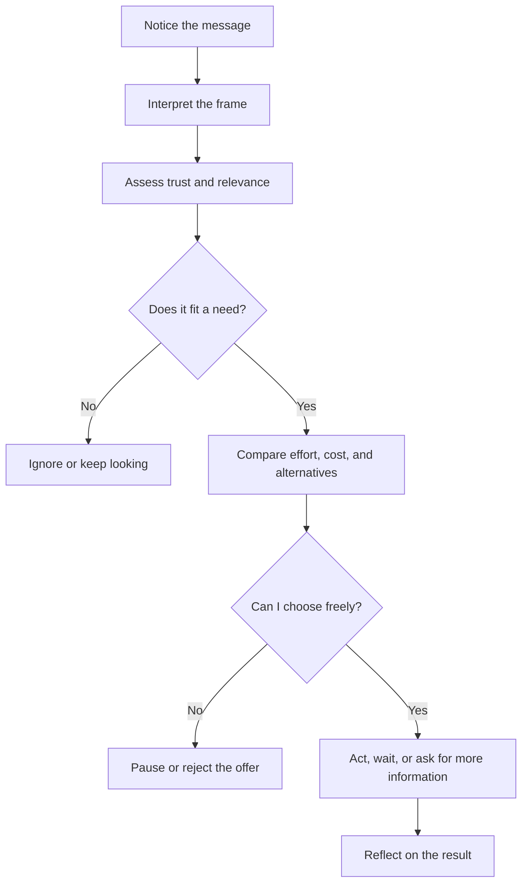

# Chapter 1: Persuasion and Human Decision-Making

Persuasion is the practice of helping shape what people notice, how they interpret it, whether they trust it, and what they choose to do. It appears in advertising, interface design, public writing, teaching, politics, fundraising, and ordinary conversation.

Persuasion does not force a decision. It creates conditions in which a person may understand an option and decide that it fits their needs. A designer persuades through choices such as wording, order, contrast, images, color, evidence, and calls to action.

Imagine a plain white T-shirt. The physical product stays exactly the same, but its presentation can invite very different interpretations:

- **Practical basics:** "A reliable white shirt for everyday wear."
- **Sustainable choice:** "A durable shirt designed to be worn often and replaced less often." This claim would need evidence about materials and production.
- **Premium essential:** "A carefully cut staple with attention to fit and fabric." The design should provide real information about those qualities.
- **Community uniform:** "The shirt worn by volunteers at neighborhood cleanups." The shirt gains meaning from the group and activity around it.

The frame changes attention and meaning; it does not magically change the cotton, fit, or construction. That difference is central to ethical persuasion.

## Persuasion, Manipulation, and Coercion

These terms are related, but they describe different relationships with an audience.

| Approach | What it does | What happens to the audience's choice |
| --- | --- | --- |
| Persuasion | Presents reasons, meaning, or evidence in a way that can influence a decision | The person can understand the appeal, question it, and decline |
| Manipulation | Uses hidden, misleading, or exploitative tactics to steer a person | The person has less ability to recognize or evaluate the influence |
| Coercion | Uses threats, punishment, or force | Refusal carries an unacceptable or imposed cost |

Persuasion can still be powerful. Power is not automatically unethical. The important questions are whether the message is truthful, whether relevant information is available, whether the audience can refuse, and whether the design exploits a vulnerability. A checkout page that clearly explains shipping costs persuades through transparency. A checkout page that hides a recurring charge until after payment manipulates through concealment.

## Cialdini's Principles of Influence

Robert Cialdini's framework identifies recurring patterns that can make a request or message more influential. These principles describe tendencies, not guarantees. A designer should treat them as lenses for understanding communication, not as buttons that control people.

1. **Reciprocity:** People often feel inclined to return a benefit or favor. A useful sizing guide can help a clothing shopper, but offering a gift should not secretly create a debt or obligation.
2. **Commitment and consistency:** After making a choice or stating a position, people often prefer actions that fit it. A customer who chooses a repairable product may be more interested in a repair service, but the earlier choice should not trap them in an unwanted purchase.
3. **Social proof:** When uncertain, people often look to what similar others do. Reviews from verified buyers can reduce uncertainty; invented reviews or selectively displayed ratings distort it.
4. **Liking:** People tend to respond more favorably to sources they like or identify with. A warm, relatable brand voice can help, but friendliness should not disguise poor quality or unfair terms.
5. **Authority:** Expertise and credible evidence can make a message more persuasive. A garment worker, materials specialist, or independent test may provide useful authority; a costume, title, or vague expert claim is not proof.
6. **Scarcity:** Limited availability can increase perceived value and urgency. A genuinely limited small-batch run can be described honestly; a permanently repeated "last chance" message is deceptive pressure.
7. **Unity:** People are often influenced by a sense of shared identity or belonging. A shirt supporting a real community project can communicate connection; it is exploitative to borrow a group's identity without respect, participation, or benefit.

The plain white T-shirt can activate several of these principles without changing the object. A real customer review uses social proof. A designer's explanation of fit may use authority. A limited run may use scarcity. The ethical question is whether each signal is real and relevant.

## Other Useful Ideas

### Framing

The framing effect describes how the way information is presented can affect interpretation and choice, even when the underlying facts are similar. "Keeps its shape after repeated washing" emphasizes durability. "Made for a season of change" emphasizes identity and mood. Neither frame should replace concrete facts about fabric, care, price, or fit.

Framing is unavoidable: every design selects some details and leaves others in the background. Good design makes that selection useful without making important limitations invisible.

### Choice Architecture

Choice architecture is the design of the environment in which people make decisions. Defaults, menu order, labels, grouping, and the number of options all affect effort and attention. An apparel site might place a clear size guide beside the T-shirt's size selector and make "no email updates" an equally visible choice. That arrangement helps people act with less confusion.

Choice architecture becomes troubling when it makes the designer's preferred option easy and the person's preferred option difficult. A preselected recurring subscription, confusing cancellation path, or visually hidden fee is not made ethical merely because the user technically can find a way out.

### Ethos, Pathos, and Logos

Classical rhetoric often describes three ways a message can work together:

- **Ethos** concerns credibility and character: Who is speaking, and why should the audience trust them?
- **Pathos** concerns emotion: What feeling or human concern does the message engage?
- **Logos** concerns reasoning and evidence: What facts, examples, or logic support the claim?

For the T-shirt, ethos might come from a transparent maker profile, pathos from a story about belonging, and logos from measurements and care information. A strong message can use all three. Emotion should not be a substitute for evidence, and evidence should not be presented as if it answers every human need.

## Comparison: Influence and Its Risks

| Principle or concept | Mechanism | Ethical use | Misuse risk |
| --- | --- | --- | --- |
| Reciprocity | A benefit can create a desire to respond | Offer genuinely useful information or service | Make a person feel indebted to buy |
| Commitment and consistency | People often align later actions with earlier choices | Support a goal the person freely selected | Use a small commitment to pressure a much larger one |
| Social proof | Others' behavior helps resolve uncertainty | Show representative, authentic reviews | Fake, cherry-pick, or inflate approval |
| Liking | Familiarity and identification increase receptiveness | Use a respectful voice and real shared values | Use charm to distract from weak or unfair terms |
| Authority | Credible expertise reduces uncertainty | Explain relevant qualifications and evidence | Borrow status without relevant support |
| Scarcity | Limited access can increase urgency or value | State real limits and their reason | Manufacture urgency or hide alternatives |
| Unity | Shared identity can create belonging | Collaborate with and respect the community named | Appropriate an identity for sales |
| Framing | Presentation guides interpretation | Make relevant benefits easier to understand | Hide important facts through selective emphasis |
| Choice architecture | Context changes effort and visibility | Reduce confusion and support informed choice | Obstruct refusal, cancellation, or comparison |

## A Simple Decision Journey

The journey is not always linear. People may return to an earlier step, ask someone else, or decide not to act.

For the white T-shirt, a shopper may first notice a photograph, interpret the shirt as either a basic or a premium item, look for evidence about fit and materials, compare price and alternatives, and then buy, wait, or leave. Design influences each stage, but the shopper remains a person with goals, constraints, and the right to say no.

## Ethical Cautions

Before using a persuasive technique, check the relationship between the message and the actual product. Do not claim sustainability, popularity, expertise, scarcity, or community connection without a basis for the claim. Do not exploit fear, loneliness, financial stress, disability, age, or a lack of experience. Make costs, data practices, subscriptions, limitations, and cancellation paths visible before commitment.

Also consider outcomes after the desired action. A successful sale that leaves someone disappointed, misled, or unable to cancel is not a successful design. Persuasion should support informed agency, not merely maximize a short-term conversion number.

## Questions to Ask Before Trying to Persuade

1. What decision am I asking someone to make, and who benefits from it?
2. What does the audience need to know to make an informed choice?
3. Which facts are certain, and which claims still need evidence?
4. Am I making the option clearer, or making alternatives harder to see?
5. Can the person say no without shame, hidden cost, or unnecessary friction?
6. Am I using identity, emotion, authority, or urgency respectfully?
7. Would I describe this tactic openly to the person affected by it?
8. What could happen after the person acts, and how will I learn whether the result helped them?

## Explore Further

For deeper research, search for:

- Robert Cialdini's principles of influence and later discussions of unity
- framing effects in psychology and behavioral economics
- choice architecture and informed consent in interface design
- ethos, pathos, and logos in rhetorical analysis
- dark patterns and deceptive design practices

Use reliable academic, professional, or primary sources when investigating these topics. Search results are starting points, not evidence by themselves.

## What You Should Remember

Persuasion shapes attention, interpretation, trust, and action, but it should leave people able to understand and refuse a choice. Cialdini's principles, framing, choice architecture, and rhetoric help designers see how messages work. The plain white T-shirt shows the central lesson: presentation can change meaning without changing the object, so design must pair influence with truthfulness, transparency, and respect for human agency.
