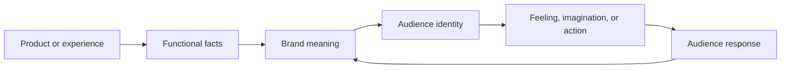

# Chapter 2: Brand Archetypes and Meaning

A plain product rarely arrives with meaning already attached to it. A white T-shirt is fabric, thread, shape, and size. Branding gives that object a role in a story. It can suggest independence, expertise, comfort, status, play, or belonging.

A **brand archetype** is a generalized cultural and narrative pattern that helps an audience recognize what a brand seems to stand for. Archetypes are practical tools for making choices about voice, imagery, behavior, and experience. They help answer a useful question:

> What does the audience get to feel, imagine, or become by choosing this brand?

An archetype is not a personality test result and not a complete strategy. It is a working hypothesis about meaning. The job is to connect a real product or service with a coherent promise that an audience can understand and evaluate.

## Why Meaning Matters

Two products can perform a similar function while inviting different identities. A white T-shirt can be presented as an inexpensive everyday uniform, a carefully made design object, a symbol of nonconformity, or a sign of shared community. The shirt itself may not change, but the surrounding language, images, materials, retail setting, and customer experience can change what it means.

This does not mean branding can make any claim believable. The product still has to support the story. A shirt framed as durable should withstand use. A shirt framed as a community uniform should be connected to a real community or activity. Meaning becomes credible when the product, message, and experience reinforce one another.

## Twelve Common Archetypes

These archetypes are useful starting points, not a mandatory list:

- **Explorer:** Values freedom, discovery, and self-direction. The audience may feel ready to go somewhere unfamiliar.
- **Sage:** Values knowledge, truth, and understanding. The audience may feel more informed and capable of judging for itself.
- **Creator:** Values imagination, craft, and original expression. The audience may feel able to make something distinctive.
- **Ruler:** Values order, responsibility, and control. The audience may feel established, prepared, or in command.
- **Caregiver:** Values protection, generosity, and practical support. The audience may feel looked after or able to care for others.
- **Rebel:** Values independence, challenge, and resistance to convention. The audience may feel free to reject an expected path.
- **Hero:** Values effort, courage, and improvement. The audience may feel ready to meet a difficult goal.
- **Everyperson:** Values belonging, approachability, and ordinary usefulness. The audience may feel welcome and included.
- **Innocent:** Values simplicity, optimism, and goodness. The audience may feel relieved, safe, or connected to what seems uncomplicated.
- **Jester:** Values humor, spontaneity, and play. The audience may feel lighter and more willing to enjoy the moment.
- **Lover:** Values intimacy, beauty, pleasure, and connection. The audience may feel expressive, attractive, or emotionally close to others.
- **Magician:** Values transformation, possibility, and a change in perspective. The audience may feel that an ordinary situation can become extraordinary.

These descriptions are broad on purpose. A Sage can be warm rather than cold. A Rebel can be quiet rather than loud. An Everyperson brand can have excellent design. The pattern describes a promise and a relationship, not a costume.

## The Same T-Shirt, Different Meaning

Consider one identical plain white T-shirt. The cut, fabric, and physical object remain unchanged, but the positioning changes what a buyer is invited to feel, imagine, or become.

### The Explorer T-Shirt

The shirt becomes a dependable layer for movement and unfamiliar places. Its presentation might use a packing list, field notes, or photographs of changing environments. The copy emphasizes adaptability: this is the shirt that leaves room for the next plan.

The audience is invited to imagine itself as mobile and self-directed. The design should support that promise with useful information about fit, care, and durability rather than relying only on adventure imagery.

### The Sage T-Shirt

The shirt becomes a studied essential. Its presentation might focus on measurements, fiber details, construction, washing guidance, and the reasoning behind its cut. The tone is calm and explanatory.

The audience is invited to feel informed rather than dazzled. The brand earns this role by making its evidence understandable and by admitting what it does not know or claim.

### The Rebel T-Shirt

The shirt becomes a refusal of unnecessary decoration or expected status signals. Its presentation might use direct language, stark layouts, or a message about choosing one's own uniform. The point is not that white fabric is inherently rebellious; the point is that the framing gives simplicity an oppositional meaning.

The audience is invited to imagine itself as independent. That message becomes weak if every part of the experience copies the same conventions it claims to reject.

### Three More Possibilities

The same shirt could also become:

- **Caregiver:** a comfortable, washable garment selected for people doing practical work and caring for others.
- **Creator:** a blank canvas for customization, printmaking, embroidery, or personal experimentation.
- **Jester:** an intentionally ordinary shirt used as the setup for a playful visual joke or unexpected styling.

The goal is not to pick the most dramatic archetype. The goal is to choose the meaning that best fits the product, the organization, the audience, and the actual experience.

## Archetypes Are Not Destiny

Archetypes are models, not literal personality diagnoses. They simplify a complicated cultural world so that a team can discuss patterns and make coordinated decisions. Because they simplify, they can also mislead.

A person may be curious like an Explorer, analytical like a Sage, and caring like a Caregiver. A brand may need a primary tendency and several supporting ones. A clothing company could use Creator language for its design process, Caregiver behavior in its repair program, and Everyperson accessibility in its sizing. The combination should feel intentional rather than accidental.

Cultural context matters too. A symbol that suggests freedom in one community may suggest irresponsibility in another. Humor, authority, beauty, simplicity, and rebellion are interpreted through history and lived experience. Designers should research the audience and test interpretations instead of assuming that a pattern means the same thing everywhere.

Archetypes should therefore guide questions, not replace judgment. Ask what the pattern enables, whose perspective it represents, and whether the product can honestly support the promise.

## A Practical Brand-Building Path

A useful sequence is to begin with the product and move outward toward meaning and identity. The audience's response should then provide feedback rather than being treated as a guaranteed result.

For the white T-shirt, the functional facts include its material, fit, price, and care requirements. An archetype organizes those facts into a meaning, such as independence or belonging. That meaning gives the audience a possible identity to try on. The audience's response may confirm the direction, reveal a different interpretation, or show that the product does not support the intended story.

## Comparison Table

| Archetype | Core promise | White T-shirt framing | Audience may feel or become | Misuse risk |
| --- | --- | --- | --- | --- |
| Explorer | Freedom and discovery | A flexible layer for the next destination | Independent and ready | Pretend adventure without useful product support |
| Sage | Knowledge and truth | A carefully explained, measured essential | Informed and capable | Use technical language to create false authority |
| Creator | Original expression | A blank canvas for making and customizing | Imaginative and distinctive | Treat novelty as proof of quality |
| Ruler | Order and control | A precise staple for a composed wardrobe | Established and in command | Turn status into exclusion or intimidation |
| Caregiver | Protection and support | A dependable shirt for practical care work | Supported and generous | Use concern to create guilt or obligation |
| Rebel | Independence and resistance | A refusal of unnecessary fashion signals | Free and nonconforming | Perform rebellion while enforcing conformity |
| Hero | Effort and improvement | A reliable uniform for work toward a goal | Brave and determined | Shame people who cannot meet an ideal |
| Everyperson | Belonging and usefulness | An accessible everyday basic | Welcome and included | Pretend universal appeal while excluding people |
| Innocent | Simplicity and optimism | A clean, uncomplicated staple | Safe and hopeful | Hide complexity or problems behind purity |
| Jester | Humor and play | An ordinary shirt with an unexpected twist | Lighthearted and spontaneous | Let the joke obscure price, quality, or impact |
| Lover | Beauty and connection | A tactile, carefully styled essential | Expressive and connected | Reduce identity or worth to appearance |
| Magician | Transformation and possibility | An ordinary shirt reframed as a new beginning | Changed and hopeful | Promise transformation the product cannot deliver |

## Making an Archetype Concrete

An archetype becomes useful when it changes observable design decisions. For the Explorer T-shirt, a team might prioritize clear packing information, repair guidance, and imagery that leaves room for the wearer rather than presenting a fixed lifestyle. For the Sage version, the team might prioritize transparent measurements and comparison tools. For the Rebel version, it might use a direct voice while still making ordering, returns, and limitations easy to understand.

Look for consistency across four areas:

1. **Message:** What words and stories are repeated?
2. **Visual language:** What color, type, photography, composition, and material choices reinforce the pattern?
3. **Behavior:** How does the organization treat customers, workers, communities, and mistakes?
4. **Product experience:** What does the object actually allow the audience to do or feel?

If the message says Caregiver but customer support is dismissive, the archetype is only decoration. If the message says Sage but important details are hidden, the contradiction will eventually damage trust.

## Questions to Ask When Choosing an Archetype

1. What does the audience get to feel, imagine, or become by choosing this brand?
2. What real product qualities support that promise?
3. Which archetype best describes the relationship we want to build, not just the mood we want to imitate?
4. Are we choosing one primary pattern and a small number of supporting tendencies?
5. What cultural assumptions are built into this interpretation?
6. How might different audiences read the same symbol, phrase, or image?
7. Can our behavior and customer experience prove the archetype over time?
8. What would make this positioning feel forced, stereotyped, or exclusionary?
9. What evidence would show that the audience understands the intended meaning?
10. If the archetype disappeared from the marketing language, would the product still behave consistently with it?

## What You Should Remember

Brand archetypes are flexible cultural and narrative patterns that help organize meaning; they are not fixed personality labels. The same white T-shirt can invite exploration, knowledge, rebellion, care, or play depending on the story and experience around it. Choose an archetype by asking what the audience can honestly feel, imagine, or become, then make the product and the organization's behavior support that promise.
