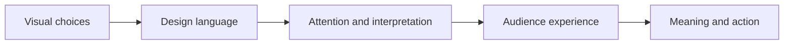

# Chapter 3: Design Language and Visual Ideas

Visual design is not decoration added after an idea is finished. It is one of the ways an idea becomes visible, organized, and memorable. Type, spacing, color, images, materials, movement, and layout all tell an audience what to notice and how to interpret it.

A design language is a recurring set of visual decisions. A website with a strict grid, restrained color, and clear hierarchy communicates differently from a website with layered type, collage, animation, and deliberate visual conflict. Neither approach is automatically better. Each creates expectations.

This chapter follows one important historical conversation: modernist design often sought clarity, order, function, and broad usefulness, while postmodern design challenged the idea that one universal visual system could represent everyone or every situation. Contemporary design continues to move between these positions.

## A Short Historical Path

### Early Modernism

Early modernism developed alongside industrialization, mass communication, new technologies, and social change. Designers and artists questioned inherited ornament and explored geometry, abstraction, photography, asymmetry, and new relationships between words and images. The goal was not simply to make things look newer. It was to find visual forms that seemed appropriate to modern life.

Many modernist projects valued reduction: remove what does not help the message, organize information, and let materials or structure become visible. This approach could make communication more legible and adaptable, but it could also imply that one rational system would work equally well for everyone.

### Bauhaus

The Bauhaus was a German school founded in 1919 that brought together art, craft, architecture, and design education. Its teaching encouraged students to study materials, form, color, workshop practice, and the relationship between making and use. The school is often associated with the idea that design should connect artistic thinking with everyday life and production.

The Bauhaus was not one single look. It was a changing institution with different teachers, workshops, and emphases. Its importance for this chapter is the way it treated design as a problem of relationships: between function and form, individual making and industry, experiment and practical use.

### Swiss / International Typographic Style

The Swiss or International Typographic Style became especially influential in the mid-twentieth century. It is commonly associated with asymmetric layouts, grids, sans-serif type, clear hierarchy, objective-seeming photography, and disciplined spacing. A grid helps a designer align information and create repeatable relationships across pages, posters, screens, or signs.

The style aimed for communication that felt direct and orderly rather than highly personal. That clarity is useful when people need to scan information quickly. At the same time, the claim to neutrality deserves examination: every choice of language, image, typeface, and hierarchy reflects some point of view.

### Postmodern Reactions

Postmodern design emerged in part as a reaction against modernist certainty, restraint, universality, and order. Instead of treating one clean system as the answer, postmodern approaches made room for plurality, quotation, irony, historical reference, ornament, expressive typography, fragmentation, and contradiction.

Postmodern design does not simply mean "messy design." A crowded page can be carefully composed, and a simple page can still be postmodern if it uses quotation or irony. The important shift is the willingness to question who defines good taste, whose identity a universal system represents, and whether function must always look restrained.

## The Tensions Designers Keep Negotiating

| Tension | One direction emphasizes | The other direction emphasizes | Contemporary example |
| --- | --- | --- | --- |
| Order and disruption | Predictability and stable relationships | Surprise, interruption, and active interpretation | A dashboard may use a consistent layout while a campaign page breaks the grid for emphasis |
| Universality and identity | A system intended to work across contexts | Specific histories, communities, and voices | A design system can provide shared components while allowing local language and imagery |
| Clarity and expression | Fast comprehension and low ambiguity | Personality, mood, and layered meaning | A public information page may be clear, while a cultural site uses expressive type |
| Grid and anti-grid | Alignment, rhythm, and repeatability | Overlap, irregularity, and movement | Product pages often use grids underneath collage-like promotional sections |
| Restraint and abundance | Fewer elements and deliberate reduction | More color, texture, reference, and sensory material | A minimal checkout can coexist with a visually rich editorial homepage |
| Function and irony | Form supports a practical task | Form comments on, questions, or playfully complicates the task | A familiar button may be redesigned to make users notice an interaction |

These are not teams that must permanently defeat each other. A useful design may be orderly in its underlying structure and expressive in its surface. A product may need a clear interface and a distinctive brand voice. The design question is what the audience needs at each moment.

## From Structure to Meaning

One way to read a design is to follow how visible choices become an experience for an audience:

For example, a strict grid and restrained type may make information feel orderly and dependable. A broken grid and expressive type may make the same information feel personal, urgent, or playful. The diagram is not a formula that determines a response; it is a prompt to examine how form can carry ideas.

## The Same White T-Shirt in Two Design Languages

The physical white T-shirt remains identical. Only the presentation changes.

### A Modernist Presentation

A modernist presentation might show the shirt in a clean studio photograph, centered on a plain field with precise measurements and a restrained sans-serif typeface. A modular grid would organize the product name, material information, sizes, price, and care instructions. The copy would be direct and economical.

This version makes the shirt feel like a rational, dependable essential. It emphasizes fit, function, repeatability, and the idea that good design removes unnecessary noise. It may be especially useful when a shopper wants to compare products quickly.

### A Postmodern Presentation

A postmodern presentation might layer the same shirt with contrasting type sizes, a playful crop, a historical reference, or an unexpected caption. It could place ordinary product language beside a dramatic image or deliberately mix visual conventions. The layout might appear to argue with its own promise of simplicity.

This version makes the shirt feel like a cultural statement or an object open to interpretation. It emphasizes identity, quotation, humor, and the fact that "basic" is not a neutral category. The presentation should still make price, fit, material, and purchasing terms findable; expressive design does not excuse unusable information.

The shirt has not become more rational or more rebellious by itself. Design language changes the role the object is asked to play.

## How to Read a Design

When looking at a poster, package, website, interface, or garment presentation, move from observation to interpretation. Try this sequence:

1. **Describe what is visible.** Note type size, type style, alignment, color, contrast, image treatment, spacing, materials, motion, and what is absent.
2. **Find the hierarchy.** What do you notice first, second, and third? How does the design direct your eye?
3. **Identify the system.** Is there a grid, repeated scale, consistent spacing, modular pattern, or recognizable component structure?
4. **Notice the disruption.** Where does the design break its own pattern? Is the break accidental, functional, expressive, ironic, or political?
5. **Ask what the form suggests.** Does it feel official, intimate, technical, playful, luxurious, local, universal, nostalgic, or urgent?
6. **Consider who is included.** What language, body, history, ability, or cultural experience does the design assume?
7. **Test function.** Can the audience complete the task? Can it read, navigate, compare, understand, or act?
8. **Separate fact from effect.** Which claims come from information, and which feelings are produced by style alone?

For the T-shirt, a centered image and measurement chart may communicate precision. A distorted crop and layered caption may communicate attitude. Neither observation alone proves quality. Ask whether the visual language supports the intended audience and use.

## Design Language Today

Contemporary web and product design regularly combines the traditions described above. A banking interface may use a strict grid, high contrast, and predictable controls because mistakes are costly. Its brand illustrations may use humor or unusual composition to feel human. A music or fashion site may break the grid for expression while keeping navigation and purchase steps stable.

Design systems make modernist ideas of consistency highly practical: shared components reduce confusion and help teams maintain products. At the same time, designers question whether a system is accessible, culturally specific, flexible, and open to voices that were not represented when its rules were chosen. Motion, personalization, responsive layouts, and user-generated content make the old order-versus-disruption question newly complicated.

The aim is not to label every current website as modernist or postmodern. Use the histories as lenses. Ask where a design seeks control and where it welcomes interpretation.

## Design History as a Set of Choices

Historical styles are not boxes that designers must enter permanently. A grid can carry a strong identity. A decorative typeface can be highly legible in the right setting. A playful design can communicate serious information. What matters is the relationship between visual decisions, audience expectations, cultural context, and practical consequences.

A designer with historical awareness can choose deliberately. Instead of saying, "This looks modern," ask: What does the order accomplish? Who benefits from the clarity? What does the expressive disruption reveal? What might the system leave out?

## Museum Research

Use museum and institutional collections to examine actual examples rather than relying on vague images in search results. Possible places to begin include The Metropolitan Museum of Art, MoMA, Cooper Hewitt, the V&A, Bauhaus archives, and other credible museum, library, or university collections. These names are research destinations, not claims about a particular object in a particular collection.

Search within an institution's own collection tools when possible. Try combinations such as:

- `Bauhaus typography poster`
- `Swiss International Typographic Style grid poster`
- `modernist graphic design sans serif`
- `postmodern typography collage`
- `design history expressive typography`
- `Bauhaus textile or product design`

When you find an example, verify the actual object record. Record the title, maker, date, medium, collection, and the institution's description if available. Do not assume that a search image is authentic, correctly dated, or representative. Compare at least two objects and identify which visual choices support your interpretation.

For a short research note, ask:

1. What can I observe directly?
2. What does the institution identify as the object's date, maker, medium, or context?
3. Which visual choices connect it to a design language or tension?
4. What remains uncertain, and what would require more research?

## What You Should Remember

Visual design carries ideas through systems of type, space, image, material, color, and interaction. Modernism, Bauhaus, and Swiss design offer tools for clarity, structure, and function; postmodern approaches challenge certainty through plurality, identity, quotation, irony, and disruption. Contemporary design continues to combine and question these approaches. The plain white T-shirt makes the lesson visible: the object can stay the same while its visual language changes what the audience thinks it is for and what it might mean.
