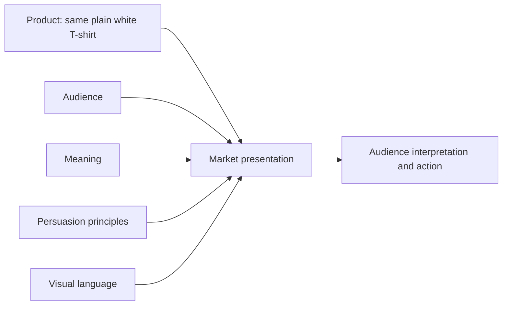

# Chapter 4: One Shirt, Four Lives

Here is the challenge: sell one ordinary high-quality plain white T-shirt four different ways without pretending that it has changed into four different physical products.

The shirt has the same basic cut, fabric, color, and construction in every concept. What changes is the audience, the story, the evidence, the visual language, and the action the presentation invites. This is branding as a design exercise: not inventing a new object, but changing the meaning attached to an existing one.

A good presentation does not merely ask, "How can we make this shirt look exciting?" It asks, "What does this audience need, value, or want to express, and what can this actual shirt honestly support?"

## Concept 1: The Next Mile

**Audience:** People who want a simple, dependable layer for travel, walking, or changing plans.

**Chosen brand archetype:** Explorer.

**Persuasion principles:** Authority through clear product information, social proof from relevant user experiences, and commitment and consistency by connecting the shirt to a self-directed habit of getting out and going somewhere.

**Visual-design language:** Functional field notes, generous white space, practical icons, route-like lines, and photographs that show changing environments without turning the shirt into a fantasy costume.

**Headline:** "Leave Room for the Next Plan."

**Short product story:** The shirt is the quiet item that earns a place in a small bag. It works under a jacket, on a long walk, or during an unplanned change of direction. The story focuses on adaptability and repeated use rather than a heroic destination.

**Imagery direction:** Show the shirt folded beside ordinary travel objects, worn in several believable settings, and photographed with enough detail to inspect its fit and fabric. Avoid implying that buying it automatically makes someone adventurous.

**Meaning the customer is invited to buy:** The customer is buying a feeling of readiness and self-direction: "I can go without overplanning every detail."

**Ethical concern or possible misuse:** Adventure imagery can exaggerate durability or suggest that a product has been tested in conditions it has not faced. State actual care and performance information, and do not use exploration as a way to hide an ordinary shirt's limitations.

## Concept 2: The Essential Unit

**Audience:** Shoppers who compare materials, fit, price, and care instructions before buying basics.

**Chosen brand archetype:** Sage, supported by Everyperson.

**Persuasion principles:** Authority through relevant evidence, framing through a focus on longevity and usefulness, and choice architecture through easy comparison and visible information.

**Visual-design language:** Restrained modernist and Swiss-influenced design: a strict grid, asymmetric alignment, sans-serif type, limited color, precise measurements, and clear hierarchy.

**Headline:** "A White T-Shirt, Clearly Considered."

**Short product story:** The shirt is presented as an everyday decision that deserves honest information. The page explains the cut, fabric, sizing, care, price, and return terms without theatrical language. The design treats clarity itself as a service.

**Imagery direction:** Use one controlled product photograph, detail crops of seams and fabric, a size diagram, and a compact comparison of fit options. Keep decorative elements subordinate to the evidence.

**Meaning the customer is invited to buy:** The customer is buying confidence in a considered choice: "I understand what I am getting, and I can decide for myself."

**Ethical concern or possible misuse:** Technical layouts can create a false impression of objectivity. Measurements and charts are useful only when they are accurate and complete. Do not use a clean grid to make weak claims look scientific.

## Concept 3: The Blank Argument

**Audience:** People who use clothing to question fashion expectations, express independence, or make a visual statement.

**Chosen brand archetype:** Rebel.

**Persuasion principles:** Liking through a distinctive voice, scarcity only if a real production limit exists, and framing by presenting plainness as a deliberate refusal of excess.

**Visual-design language:** Disruptive and postmodern: cropped images, clashing type scales, quotation marks, abrupt shifts in alignment, visual references to advertisements, and a layout that does not resolve every contradiction neatly.

**Headline:** "Nothing to Prove."

**Short product story:** The shirt is ordinary on purpose. The campaign treats the familiar white basic as a challenge to status signals and trend pressure. The joke is that a blank shirt can carry a very loud opinion about what people are expected to want.

**Imagery direction:** Pair a straightforward garment photograph with unexpected captions, overprinted text, or scenes where the shirt interrupts a more elaborate outfit. Let the design reveal its construction instead of pretending to be effortless.

**Meaning the customer is invited to buy:** The customer is buying permission to reject a performance of taste: "I choose what matters to me, even when the choice looks simple."

**Ethical concern or possible misuse:** A brand can sell rebellion while quietly demanding conformity to its own image. Do not shame people for enjoying fashion, and do not use anti-consumer language to disguise ordinary pressure to purchase.

## Concept 4: The Shared Layer

**Audience:** Friends, families, teams, and community groups that want a comfortable shared garment without a rigid uniform.

**Chosen brand archetype:** Caregiver, supported by Everyperson.

**Persuasion principles:** Unity through genuine belonging, reciprocity through useful group services such as easy care guidance, and social proof through authentic stories from participating wearers.

**Visual-design language:** Warm documentary photography, accessible typography, soft but legible color contrast, handwritten notes used sparingly, and layouts that give several people equal visual importance.

**Headline:** "Made for the Things We Do Together."

**Short product story:** The shirt appears at a neighborhood project, a rehearsal, a shared meal, or a long day of practical work. No single person is made the hero. The garment is a common layer that can hold different bodies, styles, and memories.

**Imagery direction:** Show real participants only with their permission, including varied ways of wearing the same shirt. Include practical information about sizing, care, accessibility, and how any group program works.

**Meaning the customer is invited to buy:** The customer is buying belonging and mutual support: "I can take part without needing to become identical to everyone else."

**Ethical concern or possible misuse:** Community imagery can become extractive when a brand borrows people's stories without consent or benefit. Do not imply that buying the shirt creates a community connection that the organization has not actually built.

## Concept 5: The Wearable Joke

A fourth concept is enough to meet the brief, but one more makes the comparison more interesting. It shows how an archetype can change the emotional temperature without changing the object.

**Audience:** People who enjoy playful gifts, visual surprises, and low-stakes humor.

**Chosen brand archetype:** Jester.

**Persuasion principles:** Liking through humor, framing by making an unremarkable object the punchline, and social proof through shareable but truthful reactions.

**Visual-design language:** Bright blocks of color, oversized labels, deliberately serious product diagrams, and a sequence that builds anticipation before revealing that the product is simply a white T-shirt.

**Headline:** "The Shirt Has Arrived. It Is White."

**Short product story:** The campaign refuses to pretend that every basic needs a grand origin story. It makes the audience laugh at the machinery of product hype, then gives the shirt a straightforward reason to exist: it is comfortable, well made, and easy to wear.

**Imagery direction:** Use deadpan studio photographs, exaggerated arrows, and captions that point out ordinary details. The humor should make the information easier to notice, not replace it.

**Meaning the customer is invited to buy:** The customer is buying playfulness and relief from overstatement: "I can enjoy the absurdity of shopping and still choose a useful thing."

**Ethical concern or possible misuse:** Humor can make criticism feel smarter than it is. Do not use jokes to avoid answering questions about quality, labor, price, returns, or environmental impact.

## Synthesis Table

| Concept | Audience | Archetype | Persuasion focus | Visual language | Meaning invited |
| --- | --- | --- | --- | --- | --- |
| The Next Mile | Travelers and active planners | Explorer | Evidence, relevant social proof, consistency | Field notes and practical space | Readiness and self-direction |
| The Essential Unit | Careful basics shoppers | Sage and Everyperson | Authority, framing, choice architecture | Swiss-influenced grid and hierarchy | Confidence through understanding |
| The Blank Argument | Independent style-minded shoppers | Rebel | Voice, honest framing, real scarcity only | Postmodern disruption and quotation | Freedom from expected status signals |
| The Shared Layer | Groups and communities | Caregiver and Everyperson | Unity, reciprocity, authentic social proof | Warm documentary accessibility | Belonging without sameness |
| The Wearable Joke | Playful gift buyers | Jester | Liking, humor, truthful reactions | Bright, deadpan visual comedy | Relief from exaggerated sales language |

The concepts are radically different in meaning, but none requires a different shirt. Their differences live in the relationship among audience, story, persuasion, and form.

## How the Parts Combine

A market presentation is strongest when its parts reinforce one another. The same product can enter several markets, but each presentation needs a coherent path from physical facts to audience meaning.

For example, the Essential Unit combines the same shirt with comparison-minded shoppers, a meaning of informed confidence, evidence-based persuasion, and a Swiss-influenced grid. Change those inputs to Explorer, readiness, field-note imagery, and useful performance information, and the presentation becomes The Next Mile.

## What the Exercise Reveals

The exercise has two warnings built into it. First, presentation is powerful: it can make an ordinary object feel technical, rebellious, communal, adventurous, or funny. Second, presentation is not magic. It cannot honestly create qualities the shirt does not have, and it cannot guarantee that every audience will read the design as intended.

A designer should therefore separate three questions:

1. **What is physically true about the product?**
2. **What meaning are we adding through story and design?**
3. **What pressure or promise might the audience experience?**

Answering all three keeps the case study creative without turning it into a lesson in deception.

## What You Should Remember

The same plain white T-shirt can become an Explorer's layer, a carefully explained essential, a Rebel's blank argument, a shared community garment, or a Jester's punchline. The physical product stays substantially the same; audience, archetype, persuasion, and visual language change its market meaning. Strong design makes those choices coherent and honest, while leaving the customer enough information and freedom to decide what the shirt means to them.
