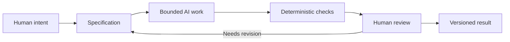

# Chapter 5: Directing Creative Work with Three Lenses

The first four chapters looked at persuasion, brand archetypes, design language, and one plain white T-shirt from different angles. This final chapter connects them. Together, the three lenses form a practical way to turn a vague creative wish into a clearer brief for a person, a team, or an AI system.

- **Persuasion** asks: **What response are we trying to enable?** Do we want attention, trust, understanding, participation, reflection, or action?
- **Archetype** asks: **What meaning or identity are we expressing?** Should the experience feel exploratory, wise, caring, rebellious, playful, or something else?
- **Design language** asks: **How should that meaning look and feel?** Should the result use a grid, expressive type, restraint, abundance, clarity, disruption, or a deliberate combination?

These questions are connected, but they are not interchangeable. A visual style cannot substitute for a truthful purpose. An archetype cannot explain every audience need. Persuasion should not become a license to pressure people. The strength comes from making the three answers support one another.

## One Object, Three Lenses

Return to the ordinary white T-shirt. A designer might decide that the intended response is confidence in a practical purchase. The archetype could be Sage, expressing careful knowledge and informed choice. The design language could be a restrained grid with precise measurements and clear hierarchy.

A different brief might seek a feeling of readiness. It could use the Explorer archetype and a field-note visual language. A third might invite playful resistance to fashion pressure through the Rebel archetype and a disruptive postmodern layout.

The shirt has not changed. The brief has changed the intended response, meaning, and form. That is why naming the lenses before making artifacts is useful: it exposes choices that might otherwise remain vague.

## A Lens for Directing AI

AI systems can generate many kinds of output quickly: prose, images, code, layouts, names, and alternatives. Speed does not guarantee that the result has the right purpose or meaning. The three-lens framework gives a prompt more direction.

Instead of asking an AI system to "make a cool campaign for a white T-shirt," specify:

- **Persuasion:** Help a careful shopper understand why the shirt is a dependable everyday choice without using false urgency.
- **Archetype:** Use the Sage, with a secondary Everyperson quality so the tone remains accessible.
- **Design language:** Use a restrained, grid-based presentation with clear hierarchy and enough detail for comparison.
- **Evidence and limits:** Do not invent fabric certifications, customer reviews, performance tests, or environmental claims.
- **Output:** Produce a headline, product paragraph, image direction, comparison table, and a checklist for human review.

This kind of prompt gives the system a bounded creative problem. It still leaves room for alternatives, but it makes the desired response, identity, style, and truth conditions visible.

## Why Specifications Matter

A specification is a written description of what should be produced, what constraints apply, and how the result will be checked. It may include the audience, purpose, required sections, tone, file path, exclusions, examples, and acceptance criteria.

Specifications matter because creative instructions are easy to interpret in multiple ways. "Make it modern" could mean a Swiss-influenced grid, a glossy technology aesthetic, or simply fewer colors. "Write about branding" could produce a history lesson, a sales pitch, or a practical exercise. A specification narrows the space of acceptable interpretations.

A useful specification does not try to predict every sentence or pixel. It establishes the boundaries that protect purpose and quality. For the T-shirt case study, requiring four radically different presentations while keeping the physical product the same is more useful than asking for "many creative ideas."

## Three Kinds of Checking

AI-assisted work benefits from several kinds of review. They do different jobs.

### Deterministic Checks

A deterministic check has a repeatable answer for a defined condition. A script can verify that a required file exists, that expected headings appear, that links point to existing files, or that a Mermaid code fence is present. A linter can catch formatting problems. A test can compare an output with a known requirement.

These checks are valuable because they are cheap, fast, and consistent. They do not get tired or become persuaded by an attractive paragraph. Their limitation is equally important: they can verify visible conditions, not every question of truth, meaning, tone, or usefulness.

### Probabilistic AI Review

An AI reviewer can summarize a draft, identify possible omissions, compare a result with a prompt, or suggest clearer wording. This can be helpful when the material is long or when a second perspective is useful.

AI review is probabilistic. It can miss a subtle error, confidently approve an invented claim, or apply a generic idea of quality that does not fit the assignment. Treat its comments as evidence to consider, not as a final verdict. Ask it to point to concrete passages and then inspect those passages yourself.

### Human Judgment

Humans remain responsible for judgment, meaning, truthfulness, context, and final decisions. A person must decide whether a claim is supported, whether a cultural reference is appropriate, whether an audience is being respected, and whether the result actually serves the assignment.

This is not a ceremonial last click. Human judgment should shape the specification before generation, inspect important decisions during review, and decide whether the final result is ready to use.

## Git as a Safety Net for Ideas

Version control matters when AI is generating work because generated output can change quickly and unpredictably. Git records a sequence of intentional changes. A commit can show what was added, a diff can reveal what changed, and an earlier version can be recovered when an experiment goes in the wrong direction.

This creates traceability: the team can ask which prompt or edit produced a result and compare versions rather than relying on memory. It also creates recovery: a promising draft can be preserved before a risky revision, and a mistaken change can be reversed without losing the entire project.

Version control does not decide whether a design is good. It gives human judgment a clearer record to inspect and a safer environment in which to experiment.

## The Pit-Stop Moment

Think of an AI-assisted workflow as a race in which automation can keep running through repeatable tasks. A race-car pit stop is different: the vehicle pauses, selected people inspect critical parts, make deliberate adjustments, and send it back onto the track.

Human review should work like that. Do not inspect every character with equal intensity, but do stop at meaningful points: after the first generated draft, before publishing, after a major change in direction, and whenever a claim affects trust or safety. Check the parts that automated speed cannot judge well: purpose, context, truth, audience impact, and coherence.

The metaphor has a limit. Creative work is not a race, and speed is not the only measure of success. The point is to reserve deliberate attention for decisions where it matters most.

## A Complete Workflow

A bounded AI workflow connects intent to an artifact through explicit stages:

The loop matters. A failed check may reveal a missing heading. Human review may reveal that the tone is wrong or a claim is unsupported. The team can revise the specification, generate a new bounded result, and preserve the earlier version in Git.

## A Small Working Checklist

Before asking AI to produce work, write down:

1. **Purpose:** What response or change should the work enable?
2. **Audience:** Who will read, use, or experience it?
3. **Meaning:** What identity, value, or relationship should it express?
4. **Design language:** What visual or verbal choices should make that meaning recognizable?
5. **Boundaries:** What must be included, excluded, or verified?
6. **Acceptance checks:** What can be checked automatically, and what requires human judgment?
7. **Recovery point:** What version should be preserved before experimenting?

This checklist is short enough to use and specific enough to prevent a vague request from becoming an unreviewable result.

## Questions for Next Week

1. Which of the three lenses is easiest for you to use, and which one do you tend to skip?
2. Think of a recent AI-generated artifact. What did its specification make clear, and what did it leave vague?
3. Which parts of your next project could be checked deterministically?
4. Which decisions require a human who understands the audience and context?
5. Where would a versioned draft help you experiment more confidently?
6. What claim, image, reference, or interaction in your project deserves the most careful review?
7. How could you use an AI reviewer without treating its approval as proof?

## What You Should Remember

Persuasion defines the response a project hopes to enable, archetype defines the meaning or identity it expresses, and design language defines how that meaning becomes visible and felt. A clear specification turns those choices into bounded AI work. Deterministic checks provide cheap, repeatable validation; AI review offers a useful but uncertain second perspective; Git provides traceability and recovery. Humans remain responsible for truthfulness, context, judgment, and the final decision.
